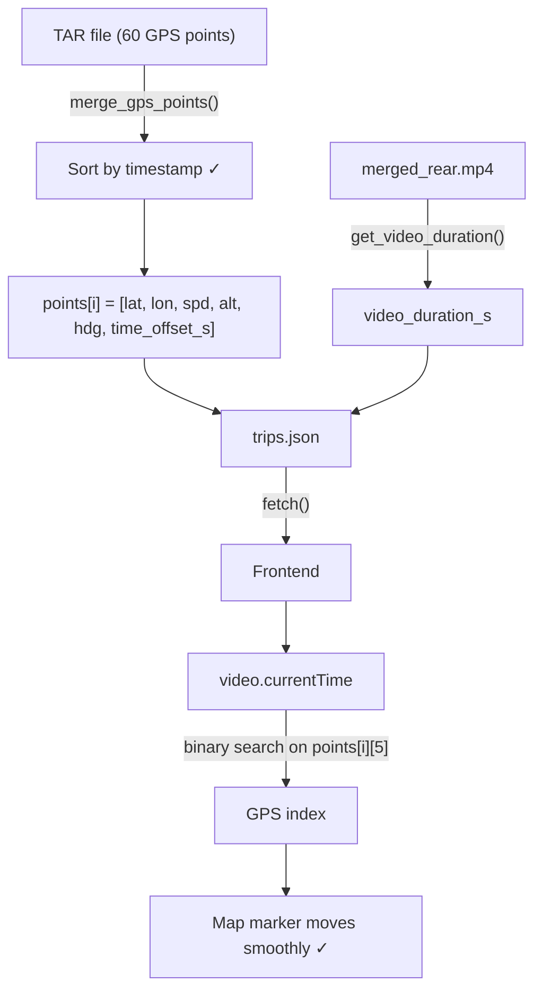

# GPS Point Ordering Fix + Timestamp-Based Sync

**Design Spec**
**Date:** March 24, 2026
**Status:** Approved for Implementation
**Priority:** P1 (Data Correctness)
**Estimated Effort:** 2–3 hours

---

## Executive Summary

GPS points are currently sorted by `(latitude, longitude)` inside `merge_gps_points()`. Each TAR file covers ~60 seconds of driving, producing 60 points sorted geographically rather than chronologically. The result: the map marker teleports 400–800 m every 60 seconds during video playback instead of moving smoothly along the route.

Fix: sort by `timestamp`, add `time_offset_s` as a 6th element to each point, and add `video_duration_s` from ffprobe. The frontend replaces linear index interpolation with binary search on `time_offset_s`.

**Evidence from trip 20260314183347 (Mar 14 18:33, 48 min):**
- Within a 60-point chunk: avg step = **6.1 m** (correct car motion)
- At every chunk boundary: jump = **422–802 m** (teleport caused by lat/lon sort)

---

## 1. Root Cause

**File:** `src/extraction/build_database.py`, line 421

```python
# BROKEN — sorts by geographic coordinates, not time
return sorted(points, key=lambda p: (p['lat'], p['lon']))

# FIX — sort by timestamp (already computed 3 lines above)
return sorted(points, key=lambda p: p['timestamp'])
```

The `timestamp` field is already present in each point dict (line 418). This is a one-line fix at the source.

---

## 2. Data Changes

### 2.1 Points Array — Add `time_offset_s`

Current format (5 elements):
```json
[lat, lon, speed_kmh, altitude_m, heading_deg]
```

New format (6 elements):
```json
[lat, lon, speed_kmh, altitude_m, heading_deg, time_offset_s]
```

`time_offset_s` = seconds elapsed since trip start (`group_start_utc`). Enables the frontend to do time-based lookup instead of index interpolation.

### 2.2 Trip Record — Add `video_duration_s`

```json
{
  "id": "20260314183347",
  "video_duration_s": 2880.70,
  "points": [...]
}
```

- Obtained via ffprobe on the merged rear video after encoding
- `null` if no video exists for the trip
- Frontend uses this instead of `duration_min * 60` (which drifts by ~0.7 s/48 min)

---

## 3. Implementation Changes

### 3.1 `src/extraction/build_database.py`

**Change 1 — Fix sort key (line 421):**
```python
return sorted(points, key=lambda p: p['timestamp'])
```

**Change 2 — Add `time_offset_s` to points output:**
When building the `points` array for `groups_data`, compute:
```python
time_offset_s = (point_timestamp - group_start_utc).total_seconds()
point_data = [lat, lon, speed, altitude, heading, round(time_offset_s, 2)]
```

**Change 3 — Add `video_duration_s` to groups_data:**
After `merge_videos()` completes, call ffprobe on the merged rear video:
```python
"video_duration_s": get_video_duration(rear_video_path) or None
```

`get_video_duration()` already exists in the codebase.

### 3.2 `src/extraction/build_database_parallel.py`

Same three changes as 3.1. Per CLAUDE.md, both files must stay in sync.

### 3.3 `web/index.html` — `onVideoTimeUpdate()`

**Replace index interpolation with binary search:**

```javascript
// Before
const gpsIndex = Math.floor((currentTime / duration_s) * points.length);

// After
function findGpsIndex(points, timeOffset) {
    let lo = 0, hi = points.length - 1;
    while (lo < hi) {
        const mid = (lo + hi + 1) >> 1;
        if (points[mid][5] <= timeOffset) lo = mid;
        else hi = mid - 1;
    }
    return lo;
}
const duration_s = trip.video_duration_s || (trip.duration_min * 60);
const gpsIndex = findGpsIndex(points, currentTime);
```

---

## 4. Data Flow



---

## 5. Testing

### 5.1 Automated

**New: `tests/test_gps_sort.py`** — static analysis:
- Assert `build_database.py` sort key contains `timestamp`, not `lat`
- Assert points output includes 6 elements
- Assert `video_duration_s` field exists in groups_data dict

### 5.2 Manual Verification

1. Run `./build.sh` to rebuild `data/trips.json`
2. Open `http://localhost:8000/web/`
3. Select trip "Mar 14 18:33 → 19:21"
4. Play video — verify marker moves smoothly with no 60-second teleports
5. Verify `trips.json` points have 6 elements
6. Verify `video_duration_s` field present and ~2880.7

---

## 6. Success Criteria

- ✅ Map marker moves smoothly along the route during video playback
- ✅ No jumps at 60-second boundaries
- ✅ `points[i]` has 6 elements including `time_offset_s`
- ✅ `video_duration_s` present in each trip with video
- ✅ All existing tests pass
- ✅ Both `build_database.py` and `build_database_parallel.py` updated

---

## 7. Files Modified

| File | Change |
|------|--------|
| `src/extraction/build_database.py` | Sort fix, add time_offset_s, add video_duration_s |
| `src/extraction/build_database_parallel.py` | Same changes (keep in sync) |
| `web/index.html` | Binary search sync, use video_duration_s |
| `tests/test_gps_sort.py` | New regression tests |

**No HTML structure changes. No new dependencies.**
