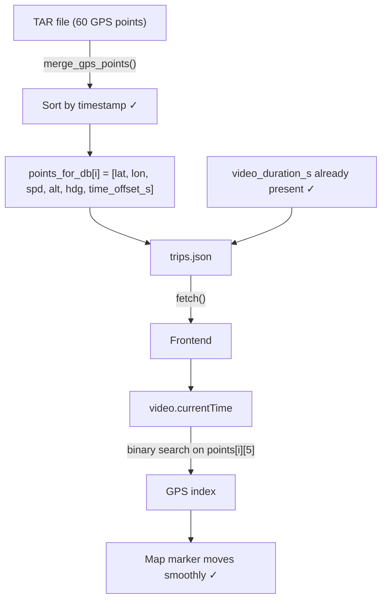

# GPS Point Ordering Fix + Timestamp-Based Sync

**Design Spec**
**Date:** March 24, 2026
**Status:** Approved for Implementation
**Priority:** P1 (Data Correctness)
**Estimated Effort:** 2–3 hours

---

## Executive Summary

GPS points are currently sorted by `(latitude, longitude)` inside `merge_gps_points()`. Each TAR file covers ~60 seconds of driving, producing 60 points sorted geographically rather than chronologically. The result: the map marker teleports 400–800 m every 60 seconds during video playback instead of moving smoothly along the route.

Fix: sort by `timestamp`, add `time_offset_s` as a 6th element to each point. The frontend replaces linear index interpolation with binary search on `time_offset_s`.

**`video_duration_s` is already present** in both build files and already consumed by the frontend — no change needed there.

**Evidence from trip 20260314183347 (Mar 14 18:33, 48 min):**
- Within a 60-point chunk: avg step = **6.1 m** (correct car motion)
- At every chunk boundary: jump = **422–802 m** (teleport caused by lat/lon sort)

---

## 1. Root Cause

**File:** `src/extraction/build_database.py`, line 421

```python
# BROKEN — sorts by geographic coordinates, not time
return sorted(points, key=lambda p: (p['lat'], p['lon']))

# FIX — sort by timestamp (already computed 3 lines above, line 418)
return sorted(points, key=lambda p: p['timestamp'])
```

The `timestamp` field is already present in each point dict (line 418). This is a one-line fix.

**Edge case:** malformed NMEA points fall back to `datetime.now()` (line 418). These will sort to the end of the chunk. Acceptable — they are rare and already represent bad data.

**Note on parallel build:** `build_database_parallel.py` imports `extract_gps_from_tar` from `build_database.py`, which internally calls `merge_gps_points`. Fixing the sort key in `build_database.py` automatically fixes it for the parallel build — **no separate sort change needed in the parallel file**.

---

## 2. Data Changes

### 2.1 Points Array — Add `time_offset_s`

Current format (5 elements):
```json
[lat, lon, speed_kmh, altitude_m, heading_deg]
```

New format (6 elements):
```json
[lat, lon, speed_kmh, altitude_m, heading_deg, time_offset_s]
```

`time_offset_s` = seconds elapsed since the first GPS point of the trip (`all_points[0]['timestamp']`). This is the correct reference — it matches actual GPS data, not the TAR filename timestamp.

### 2.2 `video_duration_s` — Already Implemented

Both `build_database.py` (line 1426) and `build_database_parallel.py` (line 277) already write `video_duration_s` using `extract_video_duration()`. The frontend (`web/index.html` line 660) already reads it with a `|| duration_min * 60` fallback. **No changes needed here.**

---

## 3. Implementation Changes

### 3.1 `src/extraction/build_database.py` — Two Changes Only

**Change 1 — Fix sort key (line 421):**
```python
return sorted(points, key=lambda p: p['timestamp'])
```

**Change 2 — Add `time_offset_s` to `points_for_db` (lines 1351–1354):**

Current:
```python
points_for_db = [
    [p['lat'], p['lon'], p['speed_kmh'], p['altitude'], p['heading']]
    for p in all_points
]
```

New:
```python
trip_start = all_points[0]['timestamp'] if all_points else None
points_for_db = [
    [p['lat'], p['lon'], p['speed_kmh'], p['altitude'], p['heading'],
     round((p['timestamp'] - trip_start).total_seconds(), 2) if trip_start else 0.0]
    for p in all_points
]
```

### 3.2 `src/extraction/build_database_parallel.py` — One Change Only

The sort fix is inherited (see Section 1). Only `points_for_db` needs updating.

The parallel file builds points inline (line 270):
```python
'points': [[p['lat'], p['lon'], p['speed_kmh'], p['altitude'], p['heading']] for p in all_points],
```

New:
```python
_trip_start = all_points[0]['timestamp'] if all_points else None
'points': [
    [p['lat'], p['lon'], p['speed_kmh'], p['altitude'], p['heading'],
     round((p['timestamp'] - _trip_start).total_seconds(), 2) if _trip_start else 0.0]
    for p in all_points
],
```

### 3.3 `web/index.html` — Replace Index Interpolation with Binary Search

In `onVideoTimeUpdate()`, replace:
```javascript
const gpsIndex = Math.floor((currentTime / duration_s) * points.length);
```

With:
```javascript
function findGpsIndex(points, timeOffset) {
    let lo = 0, hi = points.length - 1;
    while (lo < hi) {
        const mid = (lo + hi + 1) >> 1;
        if (points[mid][5] <= timeOffset) lo = mid;
        else hi = mid - 1;
    }
    return lo;
}
const duration_s = currentGroup.video_duration_s || (currentGroup.duration_min * 60);
const gpsIndex = findGpsIndex(points, currentTime);
```

`duration_s` is still needed for chart playhead positioning — keep it, just stop using it for GPS index lookup.

---

## 4. Data Flow



---

## 5. Testing

### 5.1 Automated

**New: `tests/test_gps_sort.py`** — static analysis on `build_database.py`:
- Assert sort key contains `'timestamp'`, not `'lat'` or `'lon'`
- Assert `points_for_db` list comprehension includes 6 elements

### 5.2 Manual Verification

1. Run `./build.sh` to rebuild `data/trips.json`
2. Verify `trips.json` points have 6 elements and `time_offset_s` starts at 0
3. Open `http://localhost:8000/web/`
4. Select trip "Mar 14 18:33 → 19:21"
5. Play video — verify marker moves smoothly with no 60-second teleports

---

## 6. Success Criteria

- ✅ Map marker moves smoothly along the route during video playback
- ✅ No jumps at 60-second boundaries
- ✅ `points[i]` has 6 elements; `points[0][5] == 0.0`
- ✅ Both `build_database.py` and `build_database_parallel.py` updated
- ✅ All existing tests pass

---

## 7. Files Modified

| File | Change |
|------|--------|
| `src/extraction/build_database.py` | Sort fix (1 line) + add `time_offset_s` to `points_for_db` |
| `src/extraction/build_database_parallel.py` | Add `time_offset_s` to inline points comprehension |
| `web/index.html` | Replace index interpolation with binary search |
| `tests/test_gps_sort.py` | New regression tests |

**No HTML structure changes. No new dependencies. `video_duration_s` already present — no extraction changes needed.**
